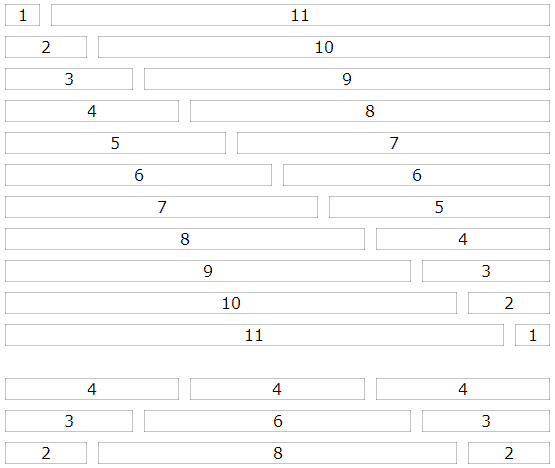

#12 разгневанных колонок!

Минималистичный 12-колоночный CSS микро-фреймворк.

Когда хочется использовать колоночную вёрстку, но нет смысла тащить тяжёлый Bootsrap...

Применение:

	

		
...

		
...

	

